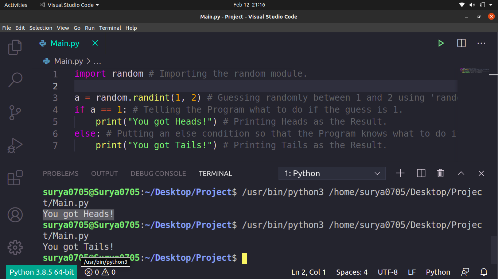

# Python_Coin_Toss
This is a Python Program that simulates a Coin Toss is Terminal. It uses a built-in module named random which would be present in your system as well if you have installed Python Correctly. Below is the Screenshot of my Program:

Hope that you Liked it!
